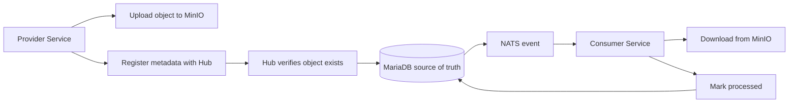

# File Exchange Hub

Reliable file handoffs through metadata registration, event notification, and consumer catch-up.

---

## The Problem

File exchange often starts simple: one system uploads a file, another system downloads it.

The hard part is everything around that handoff:

- Was the file actually uploaded?
- Which system produced it?
- Which consumers have processed it?
- What happens if a notification is missed?
- How do teams investigate delivery issues later?

---

## Why Direct Handoffs Break Down

Direct file handoffs couple producers and consumers too tightly.

If consumers depend only on polling storage or receiving a one-time signal, gaps are easy to miss:

- Consumers may be offline when a file arrives.
- File metadata may be spread across logs, object paths, and tribal knowledge.
- Teams may not have a shared source of truth for delivery state.
- Retrying safely becomes harder without idempotent tracking.

---

## The Solution

File Exchange Hub is a central registry and notification service for file deliveries.

Providers still upload file content directly to MinIO. After upload, they register the file with the hub.

The hub then:

- Verifies the object exists in storage.
- Stores searchable metadata in MariaDB.
- Publishes a NATS JetStream event for downstream consumers.
- Tracks which consumers have marked each file as processed.

---

## What The Hub Is

File Exchange Hub is not a file proxy.

It does not move bytes between systems. Instead, it coordinates the handoff:

- MinIO stores the file content.
- MariaDB stores the file record and delivery state.
- NATS JetStream sends a fast arrival signal.
- REST APIs support registration, lookup, catch-up, and completion tracking.

This keeps large file transfer separate from control-plane reliability.

---

## Runtime Flow



---

## Typical Journey

1. A provider uploads a file to MinIO.
2. The provider calls `POST /api/files/register` with metadata.
3. The hub checks the object exists.
4. The hub stores the file record.
5. The hub publishes a `files.registered` event.
6. Consumers download the file directly from MinIO.
7. Consumers call `PUT /api/files/{id}/delivery` when processing is complete.

---

## Reliability Model

The database is the source of truth.

The hub commits the file metadata before publishing the event. If event publishing fails, registration still succeeds and the response reports `eventPublished=false`.

That tradeoff is intentional:

- Producers do not lose a valid registration because messaging is temporarily unavailable.
- Consumers can recover missed notifications by querying the missing-files API.
- Operators can inspect durable state instead of relying only on event history.

---

## Catch-Up For Missed Work

Consumers are not limited to real-time notifications.

They can query:

```http
GET /api/files/missing?consumerId=consumer-A&bucket=incoming
```

The hub returns registered files that the consumer has not marked as processed.

This gives every consumer an explicit recovery path after downtime, deployment, or event delivery issues.

---

## API Surface

The service exposes a small set of purpose-built APIs:

| API | Purpose |
| --- | --- |
| `POST /api/files/register` | Register a verified file |
| `GET /api/files/{id}` | Retrieve file metadata |
| `GET /api/files` | Search registered files |
| `GET /api/files/missing` | Find files a consumer has not processed |
| `PUT /api/files/{id}/delivery` | Mark a file processed for a consumer |

---

## Operational Stack

The project uses a pragmatic backend stack:

- Kotlin 2.2 and Java 17
- Quarkus 3.24
- RESTEasy Reactive with Kotlin serialization
- MariaDB with Flyway migrations
- MinIO through the S3 client
- NATS JetStream for event notification
- Testcontainers for integration coverage

---

## Why This Design Works

The architecture separates responsibilities cleanly:

- Object storage handles large file content.
- The hub handles metadata, validation, and state.
- Messaging gives consumers a fast signal.
- The missing-files query gives consumers a safety net.
- Delivery records make processing status visible and idempotent.

The result is a more observable and recoverable file exchange workflow.

---

## Current Capabilities

The project currently supports:

- Registering file metadata only after MinIO object verification.
- Persisting metadata and delivery records in MariaDB.
- Publishing `files.registered` events to NATS JetStream.
- Searching registered files.
- Finding files missing for a specific consumer.
- Idempotently marking files as processed.
- Unit and integration tests with MariaDB, MinIO, and NATS test resources.

---

## Business Value

File Exchange Hub reduces operational risk in file-based integrations.

It gives teams:

- A shared record of what was produced.
- A clear path for consumers to recover missed work.
- Better visibility into processing completion.
- Fewer hidden dependencies between producers and consumers.
- A platform foundation for future delivery reporting and governance.

---

## Next Steps

Useful next investments:

- Add deployment packaging and environment-specific configuration.
- Add dashboards for registration and delivery health.
- Add authentication and authorization around provider and consumer access.
- Add retention, cleanup, and archival policies.
- Define operational alerts for MinIO, MariaDB, and NATS failures.

---

# File Exchange Hub

A reliable control plane for file exchange:

verify the file, record the metadata, notify consumers, and make missed work recoverable.
